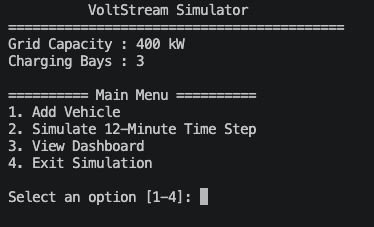
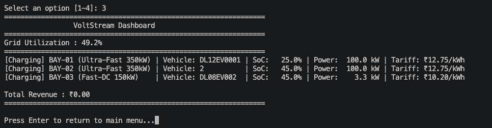
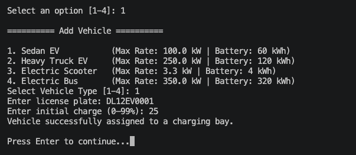
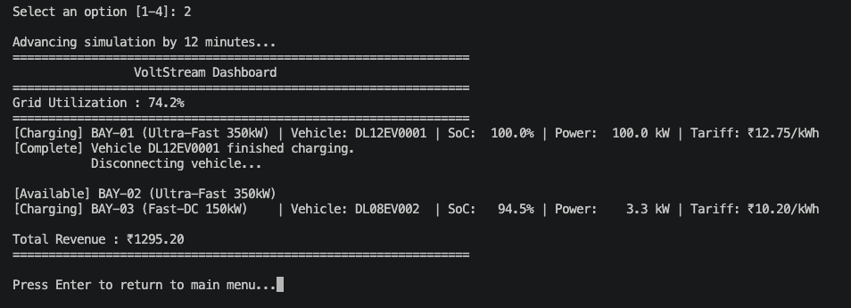

# ⚡ VoltStream

> **A Java-based simulation of a decentralized EV charging network demonstrating object-oriented design, dynamic load balancing, and real-time tariff calculation.**

---

## 📖 Overview

VoltStream is a console-based simulation of a smart electric vehicle charging network. It models multiple charging bays operating under a shared electrical grid with limited capacity.

When multiple vehicles request charging simultaneously, the system intelligently distributes available power, dynamically adjusts charging tariffs based on grid utilization, and continuously updates the charging status of every connected vehicle.

The project was built to demonstrate core **Object-Oriented Programming (OOP)** concepts through a realistic systems simulation.

---

## ✨ Features

- 🚗 Support for multiple EV types with different battery capacities and charging limits
- ⚡ Multiple charging bay types (Ultra Fast & Fast DC)
- 🔌 Dynamic vehicle allocation to available charging bays
- 📊 Real-time grid power distribution
- 💰 Dynamic tariff calculation based on:
  - Charging bay type
  - Current grid utilization
- 🛡️ Custom exception handling for invalid vehicle configurations
- 🖥️ Interactive console dashboard
- 📈 Live simulation with configurable time progression

---

## 🏗️ System Architecture

```
                    EVNetworkController
                             │
          ┌──────────────────┴──────────────────┐
          │                                     │
     Charging Bays                      Tariff Engine
          │
     ┌────┴────┐
     │         │
UltraFast   FastDC
     │         │
     └────┬────┘
          │
   ElectricVehicle
          │
      GenericEV
```

The **EVNetworkController** acts as the central coordinator by:

- managing charging bays
- allocating available grid power
- dispatching arriving vehicles
- advancing the simulation
- updating charging sessions

---

## 📂 Project Structure

```
VoltStream
│
├── src
│   ├── grid
│   │   ├── EVNetworkController.java
│   │   ├── ChargingBay.java
│   │   ├── FastDCBay.java
│   │   ├── UltraFastBay.java
│   │   ├── TariffEngine.java
│   │   ├── GenericEV.java
│   │   ├── VehicleType.java
│   │   └── Main.java
│   │
│   ├── exception
│   │   └── InvalidVehicleException.java
│   │
│   └── util
│       └── VisualUtility.java
```

---

## ⚙️ Simulation Workflow

```
Vehicle Arrives
       │
       ▼
Vehicle Validation
       │
       ▼
Charging Bay Allocation
       │
       ▼
Grid Power Distribution
       │
       ▼
Tariff Calculation
       │
       ▼
Charging Progress
       │
       ▼
Dashboard Update
```

---

## 🧠 OOP Concepts Demonstrated

- Abstraction
- Encapsulation
- Inheritance
- Polymorphism
- Interfaces
- Enums
- Composition
- Exception Handling
- Modular package design

---

## 🛠️ Technologies Used

- Java
- Eclipse IDE
- Object-Oriented Programming
- Java Collections Framework

---

## 🚀 Getting Started

Clone the repository

```bash
git clone https://github.com/invin7/VoltStream.git
```

Navigate to the project

```bash
cd VoltStream
```

Compile and run

```bash
javac src/com/voltstream/grid/Main.java
java com.voltstream.grid.Main
```

Or simply import the project into Eclipse and run `Main.java`.

---

## 📸 Screenshots

| Main Menu | Dashboard |
|-----------|-----------|
|  |  |

| Add Vehicle | Charging Progress |
|-------------|-------------------|
|  |  |

---

## 🎯 Learning Outcomes

This project strengthened my understanding of:

- Designing software using Object-Oriented principles
- Modeling real-world systems through abstraction
- Building modular Java applications
- Applying polymorphism to simplify business logic
- Simulating constrained resource allocation problems

---

